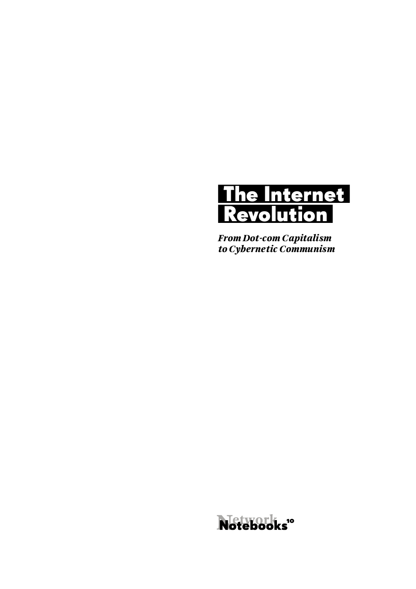

#Title Page

# The Internet Revolution: From Dotcom Capitalism to Cybernetic Communism
<!-- backcover text -->
Richard Barbrook and Andy Cameron’s *The Californian Ideology*,
originally published in 1995 by *Mute* magazine and the nettime
mailinglist, is the iconic text of the first wave of Net criticism. The
internet might have fundamentally changed in the last two decades, but
their demolition of the neoliberal orthodoxies of Silicon Valley remains
shocking and provocative. They question the cult of the dot-com
entrepreneur, challenging the theory of technological determinism and
refuting the myths of American history. Denounced as the work of ‘looney
lefties’ by Silicon Valley’s boosters when it first appeared, *The
Californian Ideology* has since been vindicated by the corporate
take-over of the Net and the exposure of the NSA’s mass surveillance
  programmes.

Published in 1999 at the peak of the dot-com bubble, Richard Barbrook’s
*Cyber-Communism* offers an alternative vision of the shape of things to
come, inspired by Marshall McLuhan’s paradoxical ‘thought probes’. With
the Californian Ideology growing stronger, the Net was celebrated as the
mechanical perfection of neoliberal economics. Barbrook shows how this
futurist prophecy is borrowed from America’s defunct Cold War enemy:
Stalinist Russia. Technological progress was the catalyst of social
transformation. With copyright weakening, intellectual commodities were
mutating into gifts. Invented in capitalist America, the Net in the
late-1990s had become the first working model of communism in human
  history.

In an introduction written specially for this 20th anniversary edition, Richard Barbrook takes a fresh look at the hippie capitalists who shaped
Silicon Valley and explains how their influence continues to this day.
These thought probes are still relevant in understanding the
contradictory impact of ubiquitous social media within the modern world.
As McLuhan had insisted, theoretical provocation creates political understanding.

Richard Barbrook is a senior lecturer in the Faculty of Social Sciences and Humanities at the University of Westminster. In the early 1980s, he was involved with pirate and community radio broadcasting. His wrote extensively on the Net in his books Media Freedom, The Hi-Tech Gift Economy, Cyber-communism, The Regulation of Liberty, The Class of the New and Imaginary Futures. In 2014, his book about Situationist gaming was published, Class Wargames: Ludic Subversion Against Spectacular Capitalism.

